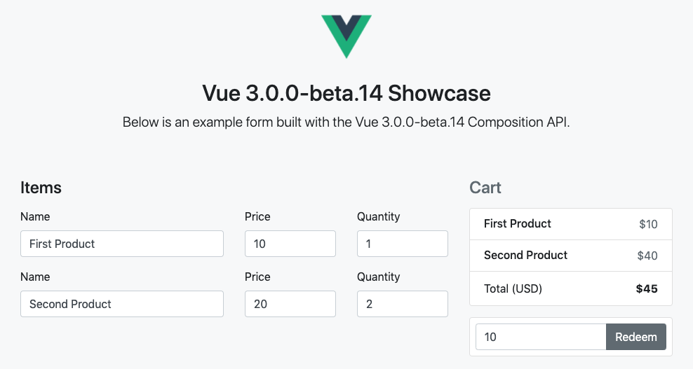

# Vue 3 Playground

Vue 3 Playground stands as a learning project for those who want to get familiar with [the new features of Vue 3](https://composition-api.vuejs.org/).

The project aims to include all the new features. If you find something missing please create an issue/PR.

The application is a shopping cart where you can alter the name, price and quantity of the products and
recalculates the total price based on the items and used coupon.

The playground is available also [in online version](https://codesandbox.io/s/github/blacksonic/vue-3-playground).

If you want to switch to the Typescript folder uncomment the link to the Typescript main file in `inndex.html`
and comment out the Javascript main file.

### New APIs covered

The Typescript equivalents can be found in the `src-typescript` folder (file names are the same).

- [createApp](https://github.com/blacksonic/vue-3-playground/blob/master/src-javascript/main.js) - [RFC docs](https://github.com/vuejs/rfcs/blob/master/active-rfcs/0009-global-api-change.md)
- [use](https://github.com/blacksonic/vue-3-playground/blob/master/src-javascript/main.js) - [RFC docs](https://github.com/vuejs/rfcs/blob/master/active-rfcs/0009-global-api-change.md)
- [ref](https://github.com/blacksonic/vue-3-playground/blob/master/src-javascript/hooks.js) - [Composition API docs](https://composition-api.vuejs.org/#code-organization)
- [reactive](https://github.com/blacksonic/vue-3-playground/blob/master/src-javascript/hooks.js) - [Composition API docs](https://composition-api.vuejs.org/#code-organization)
- [computed](https://github.com/blacksonic/vue-3-playground/blob/master/src-javascript/hooks.js) - [Composition API docs](https://composition-api.vuejs.org/#code-organization)
- [toRefs](https://github.com/blacksonic/vue-3-playground/blob/master/src-javascript/components/Cart.vue) - [Composition API docs](https://composition-api.vuejs.org/#code-organization)
- [watchEffect](https://github.com/blacksonic/vue-3-playground/blob/master/src-javascript/components/Cart.vue) - [Composition API docs](https://composition-api.vuejs.org/#code-organization)
- [watch](https://github.com/blacksonic/vue-3-playground/blob/master/src-javascript/components/Cart.vue) - [Composition API docs](https://composition-api.vuejs.org/#code-organization)
- [onMount](https://github.com/blacksonic/vue-3-playground/blob/master/src-javascript/components/Cart.vue) - [Composition API refernce](https://composition-api.vuejs.org/api.html#lifecycle-hooks)
- [onUnmount](https://github.com/blacksonic/vue-3-playground/blob/master/src-javascript/components/Cart.vue) - [Composition API refernce](https://composition-api.vuejs.org/api.html#lifecycle-hooks)
- [onUpdate](https://github.com/blacksonic/vue-3-playground/blob/master/src-javascript/components/Cart.vue) - [Composition API refernce](https://composition-api.vuejs.org/api.html#lifecycle-hooks)
- [onErrorCaptured](https://github.com/blacksonic/vue-3-playground/blob/master/src-javascript/components/Cart.vue) - [Composition API refernce](https://composition-api.vuejs.org/api.html#lifecycle-hooks)
- [useStore](https://github.com/blacksonic/vue-3-playground/blob/master/src-javascript/App.vue) - [Vuex 4 docs](https://github.com/vuejs/vuex/tree/4.0)
- [useRoute](https://github.com/blacksonic/vue-3-playground/blob/master/src-javascript/components/Checkout.vue) - [Vue 3 router docs](https://github.com/vuejs/vue-router-next)
- [emit](https://github.com/blacksonic/vue-3-playground/blob/master/src-javascript/components/Coupon.vue)
- [provide](https://github.com/blacksonic/vue-3-playground/blob/master/src-javascript/version.js) - [Composition API reference](https://composition-api.vuejs.org/api.html#dependency-injection)
- [inject](https://github.com/blacksonic/vue-3-playground/blob/master/src-javascript/version.js) - [Composition API reference](https://composition-api.vuejs.org/api.html#dependency-injection)
- [createStore](https://github.com/blacksonic/vue-3-playground/blob/master/src-javascript/store.js) - [Vuex 4 docs](https://github.com/vuejs/vuex/tree/4.0)
- [createRouter](https://github.com/blacksonic/vue-3-playground/blob/master/src-javascript/router.js) - [Vue 3 router docs](https://github.com/vuejs/vue-router-next)
- [defineComponent](https://github.com/blacksonic/vue-3-playground/blob/master/src-javascript/components/Payment.jsx)
- [defineAsyncComponent](https://github.com/blacksonic/vue-3-playground/blob/master/src-javascript/components/AsyncPayment.js) - [RFC docs](https://github.com/vuejs/rfcs/blob/master/active-rfcs/0026-async-component-api.md)
- [h](https://github.com/blacksonic/vue-3-playground/blob/master/src-javascript/components/Spinner.js) - [Composition API reference](https://composition-api.vuejs.org/api.html#dependency-injection)
- [JSX](https://github.com/blacksonic/vue-3-playground/blob/master/src-javascript/components/Payment.jsx)
- [Suspense](https://github.com/blacksonic/vue-3-playground/blob/master/src-javascript/components/Cart.vue)
- [Async Component](https://github.com/blacksonic/vue-3-playground/blob/master/src-javascript/components/Exchange.vue)
- [Teleport](https://github.com/blacksonic/vue-3-playground/blob/master/src-javascript/components/Header.vue) - [RFC docs](https://github.com/vuejs/rfcs/blob/master/active-rfcs/0025-teleport.md)
- [Fragments](https://github.com/blacksonic/vue-3-playground/blob/master/src-javascript/App.vue)
- [Multiple v-models](https://github.com/blacksonic/vue-3-playground/blob/master/src-javascript/components/Cart.vue) - [RFC docs](https://github.com/vuejs/rfcs/blob/master/active-rfcs/0011-v-model-api-change.md)
- [Scoped slot](https://github.com/blacksonic/vue-3-playground/blob/master/src-javascript/components/Cart.vue) - [RFC docs](https://github.com/vuejs/rfcs/blob/master/active-rfcs/0001-new-slot-syntax.md)
- [Custom directive](https://github.com/blacksonic/vue-3-playground/blob/master/src-javascript/at-sign.js)

### Further articles/videos

- [Composition API docs](https://composition-api.vuejs.org/)
- [RFCs describing new features](https://github.com/vuejs/rfcs)
- [Reactivity: Vue 2 vs Vue 3](https://www.vuemastery.com/blog/Reactivity-Vue2-vs-Vue3/)
- [Global Vue Meetup featuring Evan You](https://www.youtube.com/watch?v=Nk3cC7xNfkk)
- [State of Vuenion](https://www.vuemastery.com/conferences/vueconf-us-2020/state-of-the-vuenion/)
- [The process: Making Vue 3](https://increment.com/frontend/making-vue-3/)
- [Vue 3 Async Components and Bundle Splitting](https://lmiller1990.github.io/electic/posts/20200503_vue_3_async_components_and_bundle_splitting.html)
- [Reactivity in Vue 2, 3, and the Composition API](https://vuejsdevelopers.com/2017/03/05/vue-js-reactivity/)
- [React Hooks vs. Vue 3 Composition API](https://academy.esveo.com/en/blog/Yr)
- [Vue 3 Composition API TodoMVC implementation with Vuex and testing](https://github.com/blacksonic/todomvc-vue-composition-api)

### Contributing

This project is under development. If you have any idea how to include more and more new features of Vue 3 in this application feel free to share your ideas in an issue/PR.

